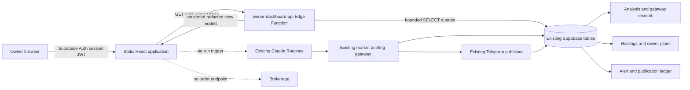

# Owner-Only Personal Stock Agent v1 Web Application

**Date:** 2026-09-03  
**Status:** Approved by the owner after verified Claude review; implementation authorized
**Product version:** Personal Stock Agent Web v1  
**Owner:** Rajrupesh  
**Repository boundary:** Suggestion-only decision support and portfolio recordkeeping

## 1. Executive summary

Build an owner-only web dashboard on top of the current Stocks Agent. The dashboard gives the owner
one secure place to understand the portfolio, current ideas, Long-Term Companion research, Telegram
alerts, scheduled-run receipts, and system health.

The web application does not replace the existing analyst, checker, policy gateway, Supabase ledger,
Telegram recorder, or scheduled routines. It reads their persisted results through a new bounded API.
It does not fetch market data in the browser, generate a second conclusion, claim that stale data is
live, or trigger a scheduled run.

The first release is deliberately read-only for financial data. Its only local mutation is the
owner's saved appearance preference. Portfolio changes continue through the current deterministic
Telegram preview-and-confirm flow until web editing receives a separate security design and rollout.

The application remains:

- personal and single-owner;
- suggestion-only;
- friend-invitations-disabled;
- brokerage-free;
- receipt-driven; and
- fail-closed when data is missing, stale, conflicting, or unauthorized.

## 2. Product objective

The dashboard should let the owner answer five questions quickly:

1. What changed since the last completed analysis?
2. Does anything need my attention now?
3. How are my current holdings and concentration changing?
4. What alternatives or companion investments are worth researching, and why?
5. What evidence and receipts support every displayed conclusion, write, and Telegram outcome?

Success is not measured by the number of charts or alerts. Success means the owner can distinguish
an observation, a research proposal, an actionable policy-approved suggestion, a suppressed alert,
and a completed delivery without opening raw database records.

## 3. Approved decisions

### Approved

- Personal, owner-only product.
- No friend accounts or invitations.
- No brokerage credentials, connections, order tickets, or execution authority.
- Suggestion-only language throughout the product.
- Midnight Navy and Warm Gold dark theme.
- Warm Pearl, Midnight Navy, and restrained Gold light theme.
- Browser/device appearance is the initial default.
- The owner may manually select Light or Dark; the browser remembers the override.
- Green, amber, and red are reserved for financial or operational meaning rather than decoration.
- Scheduled verification continues independently while dashboard design and implementation proceed.
- Implementation starts from `codex/owner-alert-v3`, not the deferred multi-user branch.
- The dashboard API uses a dedicated database role with direct `SELECT` privileges only; it receives
  no Supabase service-role key and executes no database RPC.
- Supabase project-level public sign-up remains disabled, access JWTs expire after 15 minutes, and
  explicit sign-out revokes the session server-side.

### Approved architecture for Web v1

- Seven-page information architecture: Today, Portfolio, Ideas, Companion, Alerts, Runs, and System.
- Read-only financial data in v1.
- React, TypeScript, and Vite static frontend.
- Supabase Auth with one pre-created owner account and public sign-up disabled.
- A new `owner-dashboard-api` Supabase Edge Function as the only financial-data boundary exposed to
  the browser.
- Static frontend hosting on Cloudflare Pages, using an exact production origin and strict security
  headers.

## 4. Non-goals

Web v1 will not include:

- trade placement, modification, cancellation, routing, or brokerage links;
- autonomous rebalancing or automatic recurring investments;
- portfolio, transaction, stop, plan, watchlist, or alert-rule mutations;
- manual or automatic triggering of Claude Routines;
- a free-form chatbot with access to production secrets or database mutation tools;
- friend invitations, shared portfolios, tenant switching, or multi-user row ownership;
- model-generated return numbers or numerical future-profit promises;
- social sentiment as a standalone recommendation signal;
- silent changes to policy thresholds, scores, alert cooldowns, or risk limits;
- installation or wholesale merging of the deferred multi-user web branch; or
- a claim that a successful local build proves the deployed application works.

## 5. Research synthesis

The product borrows interaction principles, not branding or proprietary layouts:

- TradingView and Stock Alarm support event-first alerts with explicit conditions and delivery
  history. The Personal Stock Agent should show what happened, when, and why.
- Finviz and TrendSpider demonstrate the value of dense screening and multi-factor inspection.
  The dashboard should place this depth inside Ideas and Runs rather than overwhelm the Today page.
- Sharesight demonstrates portfolio attribution and comparison with investable benchmarks.
  The dashboard should compare real portfolio choices rather than display isolated ticker returns.
- Bloomberg's buy-side workflow links research, portfolio context, risk, and decisions. The Personal
  Stock Agent should preserve the evidence path from source to analyst to checker to policy to
  publication.
- The current Telegram alert design establishes the required message hierarchy: new fact first,
  portfolio impact second, plan/risk fields next, and evidence access last.

Primary product references:

- [TradingView alerts](https://www.tradingview.com/support/solutions/43000520149-introduction-to-tradingview-alerts/)
- [Stock Alarm](https://stockalarm.io/)
- [TrendSpider market scanner](https://help.trendspider.com/kb/scanner/market-scanner)
- [Finviz expanded screener and maps metrics](https://finviz.com/blog/expanded-metrics-in-screener-maps/)
- [Sharesight Portfolio Investments Page](https://help.sharesight.com/show_portfolio/)
- [Bloomberg Buy-Side Solutions](https://professional.bloomberg.com/solutions/buy-side/)

Existing internal research remains authoritative for product boundaries:

- `docs/research/2026-09-02-external-stock-agent-ideas-review.md`
- `docs/design/2026-09-03-owner-only-alert-intelligence-design.md`
- `docs/design/2026-09-03-owner-portfolio-alternatives-design.md`
- `docs/design/2026-09-03-long-term-companion-design.md`

### 5.1 Baseline and branch strategy

The implementation baseline is the current owner-only release line, `codex/owner-alert-v3`, whose
runtime checkpoint is `d4e0c3d` plus this approved design and its implementation commits. It is
rooted in the reliability release on `main` and includes the production-applied migrations:

- `sql/migrations/20260901_reliable_stock_agent.sql`;
- `sql/migrations/20260902_decision_safety_gateway.sql`;
- `sql/migrations/20260903_owner_investment_plans.sql`;
- `sql/migrations/20260904_outcome_evaluation.sql`; and
- `sql/migrations/20260905_owner_alert_lifecycle.sql`.

The target backend is the existing protected `stocks-agent` Supabase project. Preview builds use
fixtures and never connect to production. Production API and schema changes use the repository's
protected Supabase deployment and verification path.

`codex/stock-agent-reliability` remains a deferred, separate multi-user experiment. It is not the
release candidate for this dashboard and will not be merged wholesale. A reviewed implementation
may copy an individual pattern, such as static-host headers, JWT verification, browser tests, or
least-privilege role provisioning, only after adapting it to the current owner-only schema and
testing it on this branch. Its multi-user schema, account/connection screens, run triggers, and
financial mutation endpoints remain excluded.

## 6. Architecture options considered

### Option A: Browser queries Supabase tables directly

The frontend signs in with Supabase Auth and uses RLS to query tables.

**Advantages:** fewer components and less server code.  
**Disadvantages:** current tables are single-owner and do not carry `owner_id`; exposing them would
require broad authenticated select policies or a large RLS redesign. It would also couple the UI to
raw schemas and risk exposing internal analyst/checker payloads and bounded operational errors.

**Decision:** reject for v1.

### Option B: Static frontend plus owner-only read API

The frontend authenticates with Supabase Auth, then calls a fixed read-only Edge Function. The
function verifies the immutable owner user ID, connects with a dedicated database login that has
direct `SELECT` access only to allowlisted columns, removes fields that the UI does not need,
computes freshness labels, and returns versioned view models.

**Advantages:** smallest exposed data surface, stable UI contracts, centralized freshness and
redaction rules, exact CORS, and a clear audit boundary.  
**Disadvantages:** adds one service and a set of API contract tests.

**Decision:** recommended.

### Option C: Resume the deferred multi-user web platform

The deferred branch contains useful React, Vite, browser-test, security-header, and API repository
patterns. It also contains multi-user schemas, connection flows, account features, and portfolio
mutation concepts that conflict with the current personal product.

**Decision:** reject wholesale merging. Reuse individual presentation, test, or header patterns only
after file-by-file review, adaptation to current schemas, and new tests. Do not bring across
multi-tenancy, friend invitations, connection screens, or mutation endpoints.

## 7. Recommended system architecture



### 7.1 Frontend

- React, TypeScript, and Vite.
- Client-side routing for seven pages and run details.
- No server-side rendering required for the private owner dashboard.
- No third-party analytics, advertising, chat widgets, remote fonts, or runtime scripts.
- Supabase URL and publishable/anonymous key may be public client configuration.
- Service-role keys, gateway secrets, Telegram tokens, provider keys, and owner identifiers never
  enter frontend assets or logs.
- React renders all strings as text by default. The application does not use unbounded
  `dangerouslySetInnerHTML`.

### 7.2 Owner dashboard API

Add `supabase/functions/owner-dashboard-api`. Supabase platform-level `verify_jwt` is disabled so a
browser's unauthenticated CORS preflight can reach the function. The function performs the complete
JWT verification itself for every non-`OPTIONS` request.

The function:

1. accepts `GET` and bounded `OPTIONS` requests only;
2. validates JWT issuer, audience, expiration, and subject;
3. loads `DASHBOARD_OWNER_USER_ID`; if it is absent, empty, or not a canonical UUID, returns a safe
   `503 temporarily_unavailable` before any database connection or query;
4. compares the immutable JWT subject with `DASHBOARD_OWNER_USER_ID` using an exact UUID match;
5. rejects every other authenticated or anonymous user before any database query;
6. handles bounded `OPTIONS` in-function with exact-origin echo and no wildcard;
7. performs fixed, paginated, direct `SELECT` queries through a dedicated `NOBYPASSRLS` database
   login that has no insert, update, delete, truncate, application-function execute, create, or
   ownership privileges;
8. executes no RPC, stored procedure, trigger-inducing write, provider call, Telegram call, or
   Routine invocation;
9. maps raw records into allowlisted response contracts;
10. attaches receipt-derived `data_as_of` and freshness status;
11. sets `Cache-Control: no-store` on every response containing owner or operational data; and
12. returns a bounded request ID and safe error code without raw database or secret-bearing errors.

The migration grants a NOLOGIN `stock_agent_dashboard` role only allowlisted column-level `SELECT`
permissions and explicit `FOR SELECT` RLS policies on the owner-only tables. A separately provisioned
LOGIN role inherits only `stock_agent_dashboard`, has a fixed restricted `search_path`, and receives
no application-function execution or schema-creation privilege.

The Edge Function receives only `DASHBOARD_DATABASE_URL`, the public Supabase URL needed for JWKS,
the exact origin allowlist, and the immutable owner UUID. It does not receive the Supabase
service-role key. Database-side dashboard audit rows are intentionally excluded because they would
violate the read-only boundary; bounded, redacted request observability stays in Edge Function logs.
Repository tests must prove that the dashboard repository exposes direct `SELECT` methods only and
contains no RPC, insert, update, delete, provider, Telegram, or Routine-trigger method.

### 7.3 Existing services

The following remain unchanged by the dashboard release:

- `market-briefing-gateway` and its protected deployment path;
- `telegram-portfolio` and its owner confirmation semantics;
- Claude pre-market, intraday, and post-market Routines;
- Friday ChatGPT weekly process audit;
- active market policy and shadow/canary controls; and
- current Supabase ledgers and receipt tables.

Dashboard work cannot be used as evidence that these services completed a run or delivered a
message. Only their own persisted receipts support those claims.

## 8. Authentication and session design

### 8.1 Account creation

- Disable public sign-up in the Supabase project configuration. This server-side setting is the
  authoritative account-creation control.
- Pre-create exactly one Supabase Auth account for the owner.
- Store the owner's immutable Supabase Auth user UUID in the Edge Function secret
  `DASHBOARD_OWNER_USER_ID`.
- Before deployment, verify out of band that the configured UUID exactly matches the sole intended
  `auth.users` row. The dashboard runtime receives no Auth Admin or `auth.users` privilege and does
  not attempt to count users itself.
- Treat email address as a login destination, not the authorization identity.
- Redirect authentication only to explicit local and production URLs.

### 8.2 Sign-in

- Use a passwordless email OTP code for the pre-created owner account and send
  `shouldCreateUser: false` on every sign-in request as defense in depth.
- Show the same neutral response for known and unknown email addresses in the dashboard as a
  best-effort account-discovery reduction. The actual controls are project-level sign-up disablement,
  OTP policy, and rate limiting.
- Apply Supabase rate limits and a frontend retry delay.
- Never log the OTP, access token, refresh token, or full authorization header.

### 8.3 Session storage

- Keep the Supabase session in `sessionStorage` for v1, not persistent `localStorage`.
- Configure a 15-minute Supabase access-JWT expiry with refresh-token rotation.
- Explicit sign-out calls Supabase global sign-out and clears protected in-memory/session state only
  after server-side revocation succeeds or the UI has entered a fail-closed signed-out state.
- Lock the UI after 30 minutes of inactivity and require reauthentication before displaying more
  financial data. This is an attended-device and shoulder-surfing convenience, not protection against
  a previously exfiltrated token; JWT expiry, refresh rotation, CSP, and revocation provide the
  security boundaries.
- The appearance preference is the only item stored in `localStorage`.
- Theme storage contains only `system`, `light`, or `dark`; it contains no financial data.

### 8.4 Authorization

Authentication alone is insufficient. Every API request must pass the immutable owner UUID check.
An authenticated non-owner receives `403 owner_only` and no portfolio metadata.
Missing, empty, or malformed owner configuration makes every non-`OPTIONS` request return a safe
`503 temporarily_unavailable`, including requests from the real owner.

## 9. Information architecture

The recommended navigation contains seven pages.

### 9.1 Today

Purpose: answer “what changed and what needs attention?” in under one minute.

Display:

- zero, one, or a small bounded list of items needing attention, always first;
- latest completed scheduled phase and receipt-derived data time;
- portfolio record value only when a supported price receipt exists;
- holding change versus recorded cost basis;
- market context from the latest completed brief;
- active policy-approved entry zones, if any;
- latest qualified Long-Term Companion summary, when present; and
- a clear no-action state when nothing qualifies.

The page must not silently combine conclusions from different run times. Each section shows its own
`data_as_of` when they differ. Every optional block collapses completely when empty; it does not
consume scan space with decorative empty cards. The no-action state remains explicit when the entire
attention list is empty.

### 9.2 Portfolio

Purpose: understand owned positions, plans, concentration, and performance evidence.

Display:

- ticker, shares, average cost, bucket, opened date, recorded stop, and recorded target;
- latest receipt-supported price and timestamp, or an explicit unavailable/stale state;
- current value and unrealized result only when both shares and supported price exist;
- position weight and concentration warning;
- current recurring plans, cadence, amount, next due date, and active state;
- transaction history with bounded pagination; and
- the latest structured Companion comparison when it is present in a completed gateway receipt.

No holding, transaction, stop, target, or plan editing appears in v1.
The dashboard does not recompute benchmark history and does not parse rendered Telegram text. The
gateway currently persists detailed structured analytics for the nominated Companion but only count
and coverage summaries for the wider alternatives set. Wider benchmark details therefore display as
unavailable in Web v1 until a separately reviewed append-only research receipt persists them.

### 9.3 Ideas

Purpose: separate research candidates from actionable, suppressed, expired, or rejected ideas.

Display:

- ticker and horizon/profile;
- final action and policy status;
- entry zone, stop, target, validity, and confidence when the accepted contract contains them;
- bull case, bear case, decisive factor, invalidation, and bounded reason codes;
- evidence freshness and source links;
- analyst and checker completion state; and
- outcome grades when eligible.

Raw prompts, chain-of-thought, hidden model state, and unbounded provider payloads are not displayed.
Checker data is shown as structured checks and reason codes, not as a claim of an independent model
when the checker was a second pass by the same model.

### 9.4 Companion

Purpose: evaluate whether one supported long-term candidate adds a distinct role beside the current
core.

Display:

- current baseline and unchanged recurring-plan status;
- candidate relationship: substitute, tilt, diversifier, replacement, or concentrated satellite;
- gateway qualification outcome;
- 3-, 5-, and 10-year annualized adjusted-price results when complete;
- max drawdown and return correlation;
- normalized rolling one-year contribution history described in past tense as lower, median, and
  higher historical outcomes;
- overlap, expense, concentration, international, currency, and valuation considerations when
  present in accepted evidence; and
- explicit “historical scenarios are not forecasts” language.

The page cannot say that the companion will outperform, will make a stated amount, or should replace
the baseline. It does not create or change a recurring plan. Performance copy uses past-tense verbs
such as “returned,” “grew,” and “had a drawdown of,” and never calls a candidate the best, top,
winner, or otherwise ranks it as an endorsement.

### 9.5 Alerts

Purpose: show the owner exactly what Telegram did and why.

Display:

- publication kind and phase;
- rendered Telegram preview;
- template version and rendered SHA-256 hash;
- publication state: ready, sending, delivered, failed, unknown, or suppressed;
- Telegram message IDs only when the persisted receipt contains them;
- delivery attempts, timestamps, and bounded safe errors;
- associated draft, rule, version, event, acknowledgement, and owner action when present; and
- suppression reason when no Telegram message was sent.

The Telegram preview uses a deterministic tokenizer that supports only the renderer's tiny formatting
allowlist and converts it into React text nodes and safe links. It does not insert stored HTML into
the DOM. Only allowlisted HTTPS source links are clickable.

### 9.6 Runs

Purpose: make the full receipt chain understandable without exposing secrets.

Display:

- run kind, start, finish, status, and data time;
- source-health summary and symbols checked;
- gateway request status and digest;
- Analyst and Checker record counts;
- policy version and accepted/downgraded/vetoed counts;
- actual database write counts;
- publication state and Telegram outcome; and
- outcome grading state when horizons become eligible.

A run detail page connects records by IDs but never infers success from a missing receipt. A missing
stage is labeled incomplete or unavailable.

### 9.7 System

Purpose: show operational health and product boundaries.

Display:

- product version separately from Edge Function deployment versions;
- latest observed pre-market, intraday, post-market, and Friday audit receipts;
- latest successful data times by source;
- stale, partial, or unavailable source states;
- current policy version and shadow/canary state;
- latest known Telegram publication outcome;
- retention status when available; and
- permanent boundaries: owner-only, friend invitations disabled, suggestion-only, and no brokerage
  authority.

System health is receipt health. The page does not label a service healthy merely because the page
loaded.

## 10. Visual design system

### 10.1 Dark mode

- Application canvas: Midnight Navy `#0E1725`.
- Navigation: Deep Midnight `#08111F`.
- Primary surfaces: Navy `#162235`.
- Primary text: Warm White `#F4F1E8`.
- Secondary text: Blue Gray `#A9B4C2`.
- Structural accent: Warm Gold `#D3A94F`.

### 10.2 Light mode

- Application canvas: Warm Pearl `#F4F1E9`.
- Navigation: Midnight Navy `#15243A`.
- Primary surfaces: Soft White `#FFFDF8`.
- Primary text: Ink Navy `#172133`.
- Secondary text: Slate `#697382`.
- Structural accent: Warm Gold `#B58A38` or an accessibility-adjusted equivalent.

WCAG 2.2 AA contrast takes precedence over exact approved token values. Any adjusted token must
remain recognizably within the approved Midnight Navy, Warm Pearl, and Warm Gold visual system.

### 10.3 Semantic colors

- Green: positive performance, successful receipt, or healthy verified state.
- Amber: watch, near-threshold, partial evidence, or owner review needed.
- Red: loss, stop/risk breach, failed receipt, or blocked unsafe condition.
- Blue: informational comparison only when it cannot be confused with the main theme control.

Color is never the only carrier of meaning. Every status also has a word, icon, or both.

### 10.4 Theme behavior

- Initial setting is `system`.
- CSS `prefers-color-scheme` follows the browser/device light or dark preference.
- A visible application control offers System, Light, and Dark.
- Manual selection is stored locally and overrides `prefers-color-scheme`.
- A tiny same-origin, render-blocking external bootstrap script reads only the theme name and applies
  it before the first painted application frame. The production CSP permits self-hosted scripts but
  contains neither an inline-script exception nor `'unsafe-inline'`.

### 10.5 Layout

- Desktop: persistent left navigation, top data-freshness bar, and content grid.
- Tablet: compact icon navigation and stacked secondary panels.
- Mobile: compact top navigation or drawer; one-column content; no clipped tables.
- The Today page is calm and editorial.
- Portfolio and Companion add charts only when they explain a comparison.
- Ideas and Runs may be denser but retain readable row spacing and progressive disclosure.

## 11. API contract

Base path: `/v1`

| Method and path | Purpose | Maximum result |
|---|---|---:|
| `GET /meta` | Product/API contract version and owner-only boundary | One object |
| `GET /today` | Latest dashboard summary | One bounded view |
| `GET /portfolio` | Holdings, plans, and summary | 100 holdings/plans |
| `GET /transactions?cursor=` | Owner transaction history | 50 rows |
| `GET /ideas?status=&cursor=` | Suggestions/evaluations and grades | 50 rows |
| `GET /companion` | Latest qualified or insufficient companion review | One review |
| `GET /alerts?state=&cursor=` | Publications, rules, and delivery receipts | 50 rows |
| `GET /runs?kind=&cursor=` | Run summaries | 50 rows |
| `GET /runs/:id` | One bounded receipt chain | One run |
| `GET /system` | Persisted operational status | One bounded view |

No `POST`, `PUT`, `PATCH`, or `DELETE` route exists in v1.
Every route, including `GET /meta`, requires a valid owner JWT. The only unauthenticated request the
function accepts is an exact-origin `OPTIONS` preflight, which returns no product, owner, portfolio,
or operational data. Pre-authentication abuse controls key on bounded origin/IP signals; successful
requests additionally key on the owner subject.

### 11.1 Response envelope

Every success response uses:

```json
{
  "contract_version": 1,
  "request_id": "uuid",
  "generated_at": "ISO-8601 UTC",
  "data_as_of": "ISO-8601 UTC or null",
  "freshness": "fresh | stale | partial | unavailable",
  "data": {}
}
```

Paginated responses add an opaque `next_cursor` or `null`. The server caps all limits even if the
client requests more.

### 11.2 Error envelope

```json
{
  "contract_version": 1,
  "request_id": "uuid",
  "error": {
    "code": "owner_only",
    "message": "This dashboard is restricted to its owner."
  }
}
```

Allowed public codes include `unauthorized`, `owner_only`, `not_found`, `rate_limited`,
`temporarily_unavailable`, and `invalid_request`. Raw Postgres, Supabase, provider, and stack errors
remain server-side and redacted.

## 12. Data sourcing and claim rules

The browser does not fetch Finnhub, Alpha Vantage, Yahoo, SEC, Reddit, or any other market/research
source directly. It reads persisted outputs that already passed the protected gateway.

| Dashboard concept | Authoritative source |
|---|---|
| Shares, cost basis, bucket, stop, target | `holdings` |
| Recorded purchases and sales | `transactions` |
| Recurring reminders | `owner_investment_plans` |
| Scheduled lifecycle | `analysis_runs` |
| Request receipt and response digest | `market_gateway_requests` |
| Analyst, Checker, evidence, and policy | `decision_evaluations` |
| Telegram rendering and delivery | `market_publications` |
| Alert lifecycle | `market_alert_drafts`, `market_alert_rules`, `market_alert_rule_versions`, `market_alert_events`, `market_alert_actions` |
| Outcome grading | `suggestion_grades` and persisted gateway grades |
| Long-term Companion | Structured `companion_analysis` in the latest completed `evaluate_and_publish` gateway response and its associated evaluations |
| Wider portfolio comparison | Coverage/count only unless a future reviewed append-only structured research receipt persists the detailed comparison |

Rules:

- A displayed market price must include its persisted timestamp and source context.
- If the latest supported price is stale, the UI says stale and does not call it current.
- A portfolio value is omitted when required prices are unavailable; it is never filled with a
  guessed or browser-fetched price.
- “Sent” requires a delivered publication receipt and Telegram message ID.
- “Suppressed” means no Telegram message was sent.
- “No write” requires persisted zero write counts or an independently verified dry-run delta.
- “Policy-approved” refers only to a specific evaluation and policy version.
- An incomplete receipt chain is displayed as incomplete, not reconstructed from prose.
- Historical comparison numbers are displayed only from structured gateway output. Presentation text
  is never parsed back into financial data.

## 13. Read-model construction

The API maps existing tables into purpose-specific views. It does not send raw rows to the browser.

Recommended server modules:

- `auth.ts`: JWT and immutable owner verification.
- `cors.ts`: exact-origin handling.
- `routes.ts`: method/path dispatch and bounded query parsing.
- `repository.ts`: select-only database access.
- `freshness.ts`: deterministic, market-calendar-aware freshness classification.
- `redaction.ts`: allowlisted fields and bounded errors.
- `mappers/today.ts`
- `mappers/portfolio.ts`
- `mappers/ideas.ts`
- `mappers/companion.ts`
- `mappers/alerts.ts`
- `mappers/runs.ts`
- `mappers/system.ts`
- `packages/dashboard-contracts`: the single canonical source for versioned server response types;
  both the Edge Function and frontend import it directly, and CI rejects duplicate local contract
  declarations.

Freshness is computed server-side against the configured market calendar and the timestamps inside
the authoritative receipts:

| Data kind | Classification rule |
|---|---|
| Regular-session quote | `fresh` only when the persisted source timestamp is no more than 20 minutes old and falls inside the validated provider trading window; otherwise `stale` or `unavailable` |
| Closed-market price | Labeled `as of close`, never `live`; remains usable as the latest close until the next configured market session opens, then becomes `stale` if no newer receipt exists |
| Scheduled market brief | `fresh` through the next configured phase deadline for the relevant NYSE trading day; after the deadline and its configured grace period it is `stale` |
| Weekend or NYSE holiday | The most recent completed trading-day brief is labeled with that date and market-closed context rather than falsely aged by wall-clock days |
| Operational run receipt | `fresh` when the latest expected scheduled run completed within its schedule-specific grace period; missing, partial, or late chains are `partial`, `stale`, or `unavailable` according to the persisted state |

The API returns the classification, the governing timestamp, and a human-readable market-state label.
It does not infer a fresh quote from page refresh time.

The current completed gateway response supports the nominated Companion through structured
`companion_analysis`. It does not persist every detailed alternatives comparison. If those wider
details become a Web requirement, add a future append-only structured research-receipt table through
a separately reviewed migration. Do not make the dashboard parse Telegram prose or recalculate
gateway research.

## 14. Frontend structure

Recommended modules:

- `apps/web/src/app`: application shell, routes, error boundary, and theme bootstrap.
- `apps/web/src/auth`: sign-in, session lock, sign-out, and owner-only errors.
- `apps/web/src/api`: typed client, timeout, retry, and response validation.
- `packages/dashboard-contracts`: canonical versioned view types imported by the web application.
- `apps/web/src/features/today`
- `apps/web/src/features/portfolio`
- `apps/web/src/features/ideas`
- `apps/web/src/features/companion`
- `apps/web/src/features/alerts`
- `apps/web/src/features/runs`
- `apps/web/src/features/system`
- `apps/web/src/components`: freshness, empty states, status labels, receipt timeline, and safe source
  links.
- `apps/web/src/styles`: tokens, global rules, light/dark themes, and responsive layouts.

Feature folders own their view mapping and tests. Shared components remain presentation-only and do
not contain hidden financial policy.

## 15. Primary user flows

### 15.1 First sign-in

1. Owner opens the HTTPS site.
2. Theme follows browser/device preference before the app paints.
3. Owner requests a passwordless email OTP code.
4. Supabase authenticates the pre-created account.
5. Frontend receives the session in `sessionStorage`.
6. First API request verifies the immutable owner UUID.
7. Today renders with explicit freshness or an actionable error state.

### 15.2 Daily review

1. Today shows the latest completed run and its data time.
2. Owner reviews the bounded attention list.
3. Owner opens a holding, idea, companion review, alert, or run for evidence.
4. Dashboard navigation never starts a new market run.
5. Any actual trade remains the owner's manual action outside the application.

### 15.3 Telegram reconciliation

1. Owner receives or records an event through the existing Telegram workflow.
2. Telegram and gateway persist their own receipts.
3. The dashboard displays the result after a refresh or bounded background refetch.
4. If delivery or persistence is incomplete, the dashboard shows the incomplete state instead of
   claiming success.

### 15.4 Theme override

1. Initial theme follows `prefers-color-scheme`.
2. Owner selects Light or Dark.
3. Frontend stores only the theme name in `localStorage`.
4. The chosen theme remains until the owner returns to System.

## 16. Failure behavior

- **No session:** show sign-in; make no financial API request.
- **Missing owner configuration:** return `503 temporarily_unavailable` before database setup; show no
  owner or system details.
- **Expired session:** clear protected data from memory and return to sign-in.
- **Authenticated non-owner:** show owner-only denial without revealing holdings, counts, or names.
- **API timeout:** retain the last in-memory view with a stale banner only during the current tab
  session; do not persist financial responses locally.
- **Partial endpoint:** render supported sections and label unavailable sections individually.
- **Missing price:** omit derived value and P&L; show the latest known timestamp if present.
- **Missing receipt stage:** show incomplete; do not infer the absent step.
- **Unknown contract version:** stop rendering that response and show an update-required message.
- **Unsafe source link:** render its label as non-clickable text.
- **Malformed Telegram formatting:** display escaped plain text.
- **Rate limit:** show retry timing; do not create a request loop.
- **Frontend exception:** use a bounded error boundary with no raw payload dump.
- **Deployment mismatch:** System shows frontend product version and receipt-derived service versions
  separately.

## 17. Security requirements

### 17.1 Browser security

- HTTPS only.
- Strict Content Security Policy with `default-src 'none'` and only required self/Supabase origins.
- No third-party JavaScript, analytics, tag managers, remote fonts, or advertising.
- `frame-ancestors 'none'`, `base-uri 'none'`, and `object-src 'none'`.
- Strict transport security, no-referrer policy, MIME sniffing protection, and restrictive
  Permissions Policy.
- Production source maps are private or omitted.
- Financial responses are not written to IndexedDB, Cache Storage, service-worker caches, or
  `localStorage`.

### 17.2 API security

- In-function JWT verification required on every non-`OPTIONS` route, including `/meta`; Supabase
  platform `verify_jwt` remains disabled only so CORS preflight can reach the handler.
- Missing, empty, or malformed owner UUID fails closed with `503` before any database access.
- Immutable owner UUID checked exactly before querying.
- Exact origin allowlist; no wildcard CORS.
- GET-only routes and fixed database queries.
- Dedicated `NOBYPASSRLS` database login with allowlisted column-level `SELECT` grants and explicit
  select-only RLS policies; no service-role key, application RPC execution privilege, table
  ownership, schema creation, or mutation grants.
- Direct `SELECT` repository methods only; no database RPC, provider request, Telegram call, or
  Routine trigger in the request path.
- Bounded page sizes, strings, JSON, timeouts, and error messages.
- Rate limits by origin/IP before authentication and by owner subject plus origin after
  authentication.
- Authorization headers and secret values redacted from logs.
- Safe request IDs support debugging without exposing payloads.
- Operational request logging remains in redacted Edge Function logs and never writes dashboard audit
  rows to the financial database.

### 17.3 Data minimization

- Do not return raw `market_gateway_requests.response` when a smaller view model suffices.
- Do not return service-role keys, provider credentials, Telegram chat/user IDs, webhook secrets,
  authorization headers, or machine-local paths.
- Return Telegram message IDs only as receipt metadata to the owner; do not expose owner Telegram
  identity fields.
- Bound or omit raw model prose that is not required for the product view.

### 17.4 Supply chain

- Pin dependency versions and commit the lockfile.
- Run dependency audit, license checks, type checking, linting, unit tests, and build in CI.
- Do not install code from reviewed external trading projects.
- Any reused code from the deferred branch receives a file-level diff and current-branch tests.

## 18. Accessibility and responsive behavior

- Meet WCAG 2.2 AA contrast for text and interactive states.
- Use semantic headings, landmarks, lists, tables, and native controls.
- All functions work by keyboard without hover.
- Visible focus states remain present in both themes.
- Status never depends on color alone.
- Dynamic refresh messages use restrained `aria-live` regions.
- Tables collapse to labeled rows or bounded horizontal containers on small screens.
- Touch targets are approximately 44 by 44 CSS pixels where feasible.
- Respect reduced-motion preferences.
- Test at 320, 390, 768, 1024, and 1440 CSS-pixel widths.

## 19. Performance and refresh policy

- Initial authenticated shell target: under 250 KB compressed application JavaScript unless a
  reviewed dependency justifies more.
- Route-level code splitting for Ideas, Companion, Alerts, Runs, and System.
- No chart library in the initial bundle; use small SVG charts or lazy-load a reviewed library only
  where it materially improves a comparison.
- Today and System may refetch every five minutes while visible.
- Other pages refetch on navigation or an explicit Refresh action.
- Background refresh stops when the tab is hidden.
- The API uses bounded parallel selects and server-side timeouts.
- Financial responses remain `no-store`; immutable hashed frontend assets may be cached long-term.

The dashboard is not marketed as real-time. Refresh frequency does not make delayed or stale source
data current.

## 20. Testing strategy

### 20.1 Contract tests

- Accept contract version 1 and reject unknown versions.
- Validate every success and error envelope.
- Verify pagination limits and opaque cursors.
- Verify missing fields produce unavailable states rather than invented values.

### 20.2 API tests

- Missing, malformed, expired, wrong-issuer, and wrong-audience JWTs fail.
- Missing, empty, and malformed `DASHBOARD_OWNER_USER_ID` return `503` before repository creation or
  calls.
- Valid authenticated non-owner fails before any repository call.
- Valid owner can reach only documented GET routes.
- Every mutation method returns `405`.
- `/meta` requires the same owner authentication as every other route.
- Exact-origin `OPTIONS` succeeds without a JWT, returns no application data, and rejects wildcard or
  unlisted origins.
- Repository exposes direct `SELECT` calls only and contains no RPC or mutation call.
- Responses omit forbidden secret and identity fields.
- Large raw database fields are bounded or mapped out.
- Database and timeout failures return safe errors.

### 20.3 Frontend unit and component tests

- System, Light, and Dark selection behavior.
- Theme override persistence stores no financial content.
- Sign-in, lock, sign-out, expiration, and owner-only denial.
- Explicit sign-out invokes global server-side revocation; inactivity lock copy does not claim token
  revocation or theft protection.
- Fresh, stale, partial, unavailable, empty, and failed states for every page.
- Calendar-aware quote, close, scheduled-phase, weekend, and holiday freshness states.
- Portfolio arithmetic only when inputs are complete.
- Suggestion, comparison, and receipt terminology.
- Historical performance language remains past-tense and contains no “best,” “top,” or “winner”
  ranking.
- Safe Telegram formatting and unsafe-link rejection.
- No-action and suppressed-alert clarity.

### 20.4 Accessibility tests

- Automated axe checks on every route and major state.
- Keyboard navigation and visible focus.
- Light and dark contrast verification.
- Screen-reader labels for status, charts, and receipt timelines.

### 20.5 Browser tests

- Owner sign-in redirect and protected routing.
- Direct deep link after authentication.
- Session expiration removes protected content.
- Responsive navigation at supported widths.
- System preference, manual override, and reload behavior.
- Receipt detail never claims a missing write or send.
- No financial request occurs before authentication.

### 20.6 Security regression tests

- Built assets contain no known secret patterns or owner identifiers.
- CSP blocks inline and third-party scripts in production.
- Theme bootstrap loads from a same-origin external asset and the production CSP contains no
  `'unsafe-inline'`.
- Raw stored HTML cannot execute.
- Untrusted source URLs cannot become clickable.
- API logs redact authorization values.
- Production build contains no fixture or mock portfolio data.

### 20.7 Production-safe verification

- Local and preview deployments use deterministic fixtures.
- Do not write integration fixtures into the production Supabase project.
- The first production verification uses the pre-created owner account and GET-only endpoints.
- Query `pg_catalog` and `information_schema.role_table_grants` through the protected deployment
  verifier and assert that the dashboard role has only the documented column/table `SELECT` grants,
  no application-function execution grants, no ownership, and no write or DDL privilege on reachable
  objects.
- If an activity check is retained, scope it to statements attributed to the dashboard database role;
  concurrent scheduler, gateway, and Telegram writes are never used to prove or disprove dashboard
  read-only behavior.
- Reconcile the displayed latest run and publication against their source database receipts.
- A local test or HTTP 200 is not deployment proof.

## 21. Implementation sequence after approval

### Phase 0: Review and freeze the design

1. Owner and Claude review this document.
2. Resolve findings and contradictions in this design.
3. Mark the design approved.
4. Produce a file-by-file implementation plan with verification checkpoints.

### Phase 1: Contracts and fixture-only application shell

1. Add workspace/package configuration without importing the deferred multi-user application.
2. Define versioned dashboard contracts and deterministic fixtures.
3. Add production CSP and security headers before application code so every phase uses the real
   browser posture.
4. Build authentication shell, external theme bootstrap, navigation, error boundary, and responsive
   layout.
5. Implement the seven pages against fixtures.
6. Run unit, accessibility, type, lint, and production-build checks.

### Phase 2: Owner dashboard API

1. Add JWT/owner verification tests first.
2. Add and verify a migration for the dedicated dashboard `SELECT` role and adapt the reviewed
   runtime-role provisioning pattern to publish only `DASHBOARD_DATABASE_URL`.
3. Implement exact CORS, routing, bounded direct-SELECT repository, freshness, redaction, and response
   mapping.
4. Add GET-only route tests, zero-RPC tests, and structural privilege tests.
5. Add the Edge Function configuration with platform `verify_jwt=false` and secrets documentation.
6. Verify locally with mocked repository data.

### Phase 3: Read-only integration

1. Connect the typed frontend API client.
2. Replace fixtures route by route.
3. Verify empty, partial, stale, error, and receipt-complete states.
4. Reconcile calculations and labels against bounded Supabase queries.
5. Confirm no browser request contacts a market-data provider or mutation route.

### Phase 4: Security and browser verification

1. Complete responsive, keyboard, contrast, CSP, and browser tests.
2. Run dependency, license, secret, and built-asset checks.
3. Obtain an adversarial Claude code review recorded in `docs/reviews/` and resolve every material
   finding before deployment.

### Phase 5: Protected deployment

1. Create the one owner Auth account; keep public sign-up disabled.
2. Configure exact redirect and CORS origins.
3. Set `DASHBOARD_OWNER_USER_ID` and `DASHBOARD_DATABASE_URL`; verify the UUID matches the sole
   intended owner account out of band, and confirm the function has no service-role secret.
4. Deploy `owner-dashboard-api` through the protected Supabase path.
5. Deploy static assets to the owner-controlled Cloudflare Pages project.
6. Verify HTTPS, security headers, authentication, and owner denial.
7. Perform GET-only receipt reconciliation and the structural database-privilege audit.

### Phase 6: Owner canary

1. Owner reviews Today, Portfolio, Companion, Alerts, and a complete Run receipt.
2. Owner verifies Light, Dark, and System behavior on desktop and phone.
3. Observe one scheduled pre-market, intraday, post-market, and Friday audit cycle through the
   dashboard without manually duplicating a live run.
4. Record only receipt-supported deployment and display claims.
5. Mark Web v1 live only after the owner accepts the canary.

## 22. Deployment and rollback

### Frontend

- Build immutable hashed assets.
- Set no-store caching for the HTML shell and long immutable caching for hashed assets.
- Deploy previews with fixture mode only; never expose production API secrets to preview builds.
- Production frontend configuration contains only public Supabase client values and API URL.
- Rollback restores the prior static deployment atomically.

### API

- Deploy as a separate function; do not modify the market gateway or Telegram function to make the
  dashboard work.
- Keep the previous function bundle available for rollback.
- A rollback removes dashboard access but does not affect scheduled analysis or Telegram delivery.
- If authorization, redaction, or CORS verification fails, disable the dashboard API immediately.
- The first-line kill switch is removing or invalidating `DASHBOARD_OWNER_USER_ID`, which makes all
  non-`OPTIONS` requests return `503` before database access. Removing the function deployment is the
  escalation. Both paths are exercised in non-production verification.

### Hosting decision

Cloudflare Pages is the recommended first host because the deferred branch already demonstrates a
static Vite deployment pattern and strict headers. The implementation must not assume Cloudflare
APIs beyond static hosting. If the owner chooses another HTTPS static host during review, only the
deployment adapter and header configuration should change; product and API contracts remain stable.

## 23. Definition of done

Personal Stock Agent Web v1 is complete only when all of the following are true:

- owner and Claude have approved the design and implementation plan;
- all seven pages render real receipt-derived data and complete empty/error states;
- System, Light, and Dark modes work, with System as the initial default;
- public sign-up is disabled and only the immutable owner UUID is authorized;
- the browser and dashboard function contain no service-role, provider, Telegram, or gateway secret;
- the dashboard database login has only audited direct-`SELECT` privileges and no RPC execution,
  ownership, DDL, or write privilege;
- the API exposes documented GET routes only;
- frontend and API tests, type checking, linting, accessibility checks, security scans, and production
  builds pass;
- an independent code review has no unresolved material finding;
- protected production deployment receipts are recorded;
- structural privilege verification proves the dashboard role cannot write financial or receipt
  tables, and any optional activity evidence is scoped only to that role;
- displayed run, write, suppression, and Telegram claims reconcile with Supabase receipts;
- owner acceptance covers desktop, mobile, light, and dark experiences;
- friend invitations remain disabled; and
- no brokerage authority exists anywhere in the web application or API.

## 24. Deferred work after v1

Each item needs a separate design and explicit owner approval:

- safe web portfolio-record editing with preview, confirmation, idempotency, and atomic receipts;
- alert lifecycle actions through the web;
- on-demand research requests with cost, deduplication, dry-run, and rate-limit controls;
- browser notifications;
- installable PWA and offline shell;
- passkey or additional MFA hardening;
- a separate read-only strategy validation lab;
- friend accounts, `owner_id`, per-owner RLS, onboarding, and tenant-isolation testing; and
- any paper-only execution experiment in a separate repository and environment.

No deferred item is implicitly approved by approving Web v1.

## 25. Verified design-review resolution and code-review targets

The owner approved the verified review revisions on 2026-09-03. The review's claim that the alert
lifecycle and three referenced designs were absent was rejected because it examined `main` and the
deferred multi-user branch rather than `codex/owner-alert-v3`. Migration `20260905` and the three
design files are present on the selected branch. The claim that the multi-user branch was the active
release candidate was also rejected; `docs/ROADMAP.md` identifies it as deferred.

The design accepted the substantive security improvements: a dedicated direct-`SELECT` database
role, zero RPC calls, structural privilege verification, fail-closed owner configuration,
project-level sign-up disablement, server-side session revocation, explicit JWT lifetime,
preflight-safe in-function authentication, calendar-aware freshness, first-phase CSP, and one
canonical contracts package. The Portfolio benchmark scope was narrowed to structured persisted
Companion data because the current gateway response does not persist every detailed alternative.

The implementation code review must challenge, at minimum:

1. Can any anonymous or authenticated non-owner learn portfolio metadata, product versions, or row
   counts?
2. Can the dashboard database login execute any RPC, mutate any object, own an object, bypass RLS,
   or reach an unallowlisted column?
3. Can the frontend convert stored Telegram text or source URLs into executable DOM?
4. Do calendar-aware freshness and mixed-run timestamps prevent false “current” claims?
5. Can any endpoint trigger a run, provider request, Telegram send, database write, or other side
   effect indirectly?
6. Are Companion histories and comparisons sourced only from structured receipts and clearly
   separated from forecasts?
7. Does the read model expose unnecessary analyst, checker, owner, or operational data?
8. Do sign-out, access-token expiry, refresh rotation, and inactivity-lock copy match their actual
   security boundaries?
9. Do Cloudflare Pages security headers and Supabase redirect/CORS rules match browser behavior?
10. Do the protected deployment receipts and structural privilege audit support every production
    claim?

## 26. Copy-paste prompt for Claude review

Use this prompt with the complete document:

> Review this Owner-Only Personal Stock Agent Web v1 design from `codex/owner-alert-v3`, not `main`
> or `codex/stock-agent-reliability`. First read `docs/ROADMAP.md`, migration
> `sql/migrations/20260905_owner_alert_lifecycle.sql`, and the three 2026-09-03 internal design files
> cited in section 5. Review as a senior product architect,
> application-security reviewer, and reliability engineer. Look for contradictions, ambiguous
> requirements, database-role blast radius, data leakage, XSS or unsafe-link
> paths, stale-data or mixed-receipt claims, accidental write/run triggers, misleading investment
> language, insufficient tests, unsafe deployment steps, and rollback gaps. Preserve these hard
> constraints: single owner, friend invitations disabled, suggestion-only, no brokerage authority,
> no autonomous execution, no financial writes in web v1, and only receipt-supported claims. Do not
> redesign this as a multi-user product or treat the deferred branch as the release candidate.
> Return findings ordered by severity with the exact section, rationale, and a concrete recommended
> text or architecture change. Then state whether the implementation is ready for protected
> deployment.
