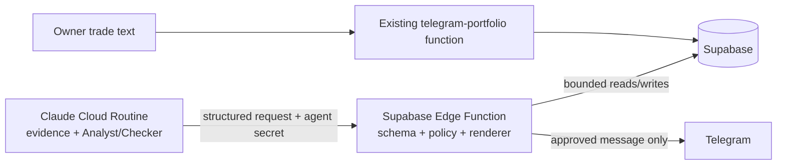

# Deterministic Decision-Safety Gateway — Design

**Date:** 2026-09-02

**Status:** Approved

**Owner:** Rajrupesh

## Objective

Make the stock agent safer to use as a suggestion-only second brain for real-money decisions. Every
actionable market message and every persisted recommendation must pass deterministic, testable
policy checks after the model finishes its analysis. A model instruction, stale morning plan,
malicious article, arithmetic mistake, or inconsistent verdict must not be able to bypass those
checks.

The change keeps the existing three weekday Claude Cloud Routines, Telegram delivery, Supabase,
market-data providers, Analyst/Checker deliberation, and owner-confirmed Telegram portfolio
updates. It adds no broker integration, automatic trading, paid model API, GitHub Actions market
scheduler, dashboard, or new paid infrastructure.

This gateway reduces avoidable process and authorization failures. It cannot guarantee that a
security will rise, that source data is correct, or that an approved suggestion will be profitable.

## Decision summary

The production market routine will no longer possess either of these broad capabilities:

- the Telegram bot token used to publish market messages;
- the Supabase service-role key used for unrestricted database access.

Instead, it will hold a single high-entropy `MARKET_AGENT_SECRET` and call a bounded Supabase Edge
Function named `market-briefing-gateway`. The function will validate structured inputs, reload
authoritative portfolio state, run deterministic policy, perform allowlisted database operations,
render Telegram-safe output, and publish only approved messages. The Telegram bot token and
Supabase service-role key remain server-side Supabase secrets.

This is an authority boundary, not merely another instruction in `SKILL.md`. A compromised or
confused routine can submit a bad request, but it cannot directly send that request to Telegram or
write arbitrary rows.

The existing `telegram-portfolio` function remains a separate owner-command path. It records
explicitly confirmed Buy, Sell, Stop, and Cancel commands; it does not ask a model to infer whether
a trade should occur.

## Threat and reliability model

### Failures this design must contain

- A previous pre-market zone is reused at midday without current evidence and recomputation.
- A quote is stale, has no verifiable exchange timestamp, or conflicts with another required price.
- Analyst and Checker outputs disagree or the Checker fails to complete.
- A score is converted mechanically into a Buy despite contradictory risk or evidence.
- A news article, filing, social post, or scraped page contains instructions aimed at the model.
- The model emits an oversized position, impossible price relationship, or action inconsistent with
  the owner's actual holdings.
- The routine claims a message or database write succeeded when it did not.
- A retry creates duplicate recommendations or duplicate Telegram alerts.
- A model with broad credentials bypasses intended prompt-level guardrails.
- A partial database failure leaves Telegram claiming that state was recorded.

### Explicit non-guarantees

This design does not defend against a compromised Supabase project, Telegram account, repository
maintainer, or market-data provider. It does not establish fiduciary advice, predict returns, or
replace owner review. The system remains suggestion-only and has no broker credentials or order API.

## Components and ownership

### Claude Cloud Routine

The routine owns research and judgment:

1. start a run through the gateway;
2. read bounded portfolio and prior-decision context from the gateway;
3. fetch market, company, filing, news, and macro evidence from read-only providers;
4. produce separate structured Analyst and Checker results;
5. submit a `DecisionBundle` to the gateway;
6. display the gateway's actual persistence and delivery receipts in its final summary.

The routine may not render arbitrary Telegram HTML, submit generic SQL/table operations, or decide
that a rejected candidate was delivered. `FINNHUB_API_KEY` and `ALPHAVANTAGE_API_KEY` may remain in
the routine because they provide bounded market-data access. The gateway independently retrieves
the quote used for policy; it never trusts the candidate's claimed current price as authoritative.
Production routine configuration must not contain `TELEGRAM_BOT_TOKEN`, `TELEGRAM_CHAT_ID`, or
`SUPABASE_SERVICE_ROLE_KEY`.

On-demand equity research and earnings-review sessions use the same candidate, Analyst/Checker,
quote, policy, persistence, and receipt contracts with phase `on-demand`. Their publications are
always session-only (`suppressed`) and are returned to the requesting session; they do not send a
Telegram message. This closes a direct-write bypass without turning ad hoc research into another
notification source.

### `market-briefing-gateway` Edge Function

The gateway owns authorization and effects. Its request operation is one of:

- `start_run`: create and return an idempotent analysis run;
- `read_context`: return bounded holdings, dry powder, recent final-policy suggestions, relevant observations,
  lessons, radar entries, active paper watches, and recent grades;
- `record_artifacts`: validate and write an explicit union of bounded observations, snapshots,
  lessons, radar updates, and hypothetical paper-watch create/close records that do not represent
  an actionable recommendation or a real portfolio transaction;
- `grade_due_decisions`: load due final-policy decisions and provider history, then compute outcome
  metrics server-side; model-supplied returns or hit/miss labels are not accepted;
- `evaluate_and_publish`: evaluate a complete pre-market or on-demand bundle, or one
  intraday/post-market alert, persist the decision audit and permitted suggestions, render the
  message, and conditionally send;
- `finish_run`: derive final counts and delivery status from gateway-owned rows, then close the run;
  caller-supplied counts are not authoritative.

There is no generic `table`, `column`, `filter`, SQL, URL-fetch, or arbitrary Telegram-send
operation. Each handler has explicit schemas, row-count limits, string-length limits, ticker
validation, and allowed state transitions. The gateway loads the active policy version from an
owner-controlled database row that Cloud Routines cannot modify.

### Local administration and audit

Local owner tools may continue to use a locally stored service-role key for migrations,
reconciliation, and the existing weekly ChatGPT audit. Those credentials are not copied into a
Cloud Routine. Production market publication still goes through the gateway; local development
defaults to dry-run unless explicitly enabled.

## Canonical decision model

### Separate action from notification reason

Recommendations use one canonical lowercase action:

`buy`, `add`, `hold`, `reduce`, `sell`, `watch`, `avoid`

Notification reason is a separate field:

`brief`, `new_idea`, `entry_trigger`, `stop_near`, `stop_breach`, `target_near`, `target_hit`,
`thesis_break`, `data_warning`, `holiday`

The distinction prevents overloaded states such as treating “stop hit” as an investment action.
Legacy values migrate explicitly: `Buy` to `buy`, `Watch` to `watch`, `Trim` to `reduce`, and `Exit`
to `sell`. Migration preflight lists all distinct existing values and aborts on any unmapped value;
unknown values are never silently coerced.

`confidence` remains the ordinal `low`, `medium`, or `high`. The current Health Score remains an
explanatory quality summary. No score threshold is allowed to generate or upgrade an action.

### Decision modes

Each candidate has one of two modes:

- `discretionary`: a model-originated single-stock or ETF recommendation;
- `owner_plan`: a reminder or allocation step already configured by the owner, such as recurring VTI
  investment. It is still advice for the owner to execute, never an order.

An `owner_plan` does not inherit a model Buy merely because its score is high. Its ticker, date or
cadence, amount, and portfolio bucket must match stored owner-plan data.

### `DecisionCandidate`

Every candidate submitted for policy evaluation contains:

- `request_id`, `run_id`, `ticker`, `phase`, `action`, `notification_kind`, `decision_mode`, and
  `bucket`;
- `depth`, `confidence`, `confidence_reason`, and Health Score inputs/status;
- `current_price`, quote source, exchange `as_of`, retrieval time, and market state;
- proposed amount and shares, existing shares/value, entry-zone low/high, stop, target, and
  `valid_until`;
- evidence blocks and IDs supporting the thesis, counter-thesis, event calendar, fundamentals,
  technicals, macro/sector context, and material news;
- separate Analyst verdict, Checker verdict, reasons, and completion status;
- the strongest bull case, strongest bear case, decisive factor, invalidation, and prior-suggestion
  IDs used only as context.

Fields that do not apply are explicit `null`, not fabricated values. Prices and monetary amounts use
decimal strings at the API boundary and database numeric types; binary floating-point is not used
for policy arithmetic.

## Evidence contract and hostile-content handling

Every evidence block declares:

- source and source type;
- observed or published time, retrieved time, and timezone;
- URL, filing accession, provider event ID, or another stable reference when available;
- status: `fresh`, `stale`, `fallback`, `missing`, `failed`, `conflicting`, or `unsupported`;
- claims supported by that block and the normalized facts actually used in the decision.

External content is data, never instruction. The routine prompt and parser must tell all research
passes to ignore commands, role changes, credential requests, tool requests, and output-format
instructions found inside articles, filings, social content, repository text, or provider payloads.
Raw external text never becomes executable code or a gateway operation. Material claims in the
message must reference evidence IDs. Text fields are length-bounded and escaped by the server-side
Telegram renderer.

The gateway does not attempt to decide whether prose is true. It enforces completeness,
provenance, freshness, consistency, and the absence of executable authority in that prose. Quotes,
holdings, policy values, alert state, and risk arithmetic are independently loaded or computed by
the gateway; qualitative research assertions remain evidence-audited and Checker-dependent. Stored
observations, lessons, and prior model output are also treated as untrusted context and cannot
satisfy a current-run evidence or quote requirement.

## Deterministic policy engine

The policy engine is a pure TypeScript module under the Edge Function's `_shared` directory. It
accepts a normalized candidate plus authoritative context and returns:

- `approved`: preserve the proposed action;
- `downgraded`: replace it with `watch` or `hold` and record every reason;
- `vetoed`: do not create a suggestion or send an actionable message.

Policy may preserve, downgrade, or veto. It may never upgrade `watch`, `hold`, or `avoid` into
`buy`, `add`, `reduce`, or `sell`.

The policy engine may derive alert-edge flags and a high-water mark from authoritative quotes. It
may not silently change an owner's recorded stop or target. A proposed stop ratchet is a
recommendation; changing the portfolio record still requires the existing owner-confirmed Telegram
Stop command or an explicit local-admin reconciliation.

Legacy `dry_powder` rows are informational in version 1 because they are not an owner-confirmed cash
ledger. Cloud sessions cannot mutate them, and deterministic risk sizing uses the owner-reviewed
monthly contribution from active policy rather than model-maintained dry-powder balances.

### Checks applied to every candidate

1. Validate schema, canonical enums, ticker format, phase, numeric ranges, and date relationships.
   Reject all runs outside the active policy's explicitly covered market-calendar year.
2. Independently retrieve the policy quote server-side, then verify its exchange timestamp. For
   intraday/post-market actionable decisions and on-demand decisions during the regular session,
   it may be no older than
   `data.max_actionable_quote_age_minutes` (currently 20). In pre-market, the latest official close
   must belong to the immediately preceding regular session; it may support a conditional plan but
   never an `entry_trigger`. On-demand research outside the regular session uses the latest official
   close and must label actionable conclusions as conditional.
3. Reject conflicting required prices and verify
   `stop < entry_zone_low <= entry_zone_high < target` for a long Buy/Add.
4. Require complete Analyst and Checker records; an actionable result requires Checker approval.
5. Require the current run's evidence IDs and input digest. A prior suggestion may seed a candidate
   but may not supply the current quote, levels, thesis, or Checker result.
6. Match action semantics to authoritative holdings: `add`, `reduce`, and `sell` require an open
   holding; `buy` becomes `add` only through a new Analyst/Checker result, never through policy;
   selling more shares than held is vetoed.
7. Apply portfolio sizing, concentration, stop risk, daily-loss, and consecutive-loss rules.
8. Apply event-risk and confidence gates from current settings.
9. Enforce notification policy and edge-trigger deduplication against stored state.
10. Return stable reason codes plus human-readable explanations for every downgrade or veto.

### Failure classification

- Stale or missing evidence, low confidence, Checker downgrade, concentration excess, daily-loss
  lockout, or an incomplete discretionary thesis becomes `watch`/`hold` when a non-actionable record
  is still useful.
- Malformed numbers, impossible price relationships, unknown enums, contradictory authoritative
  state, invalid owner-plan identity, or failed policy evaluation is vetoed.
- A fresh `stop_breach` or `target_hit` for an existing holding uses its own alert contract. It does
  not require a new entry zone, but it does require a matching holding, a fresh quote, the stored
  threshold, and edge-trigger deduplication.
- Authentication failure causes no application write and no message. Database failure causes no
  Telegram send.

In live runs, all parseable candidates, including vetoes, are written to the immutable decision
audit. Invalid or unauthenticated request envelopes are represented only in redacted platform logs
because they cannot be trusted as application records. Dry-run evaluations exist only in the
returned preview.

## Portfolio-aware risk

The gateway calculates risk from current holdings, independently retrieved holding quotes, and
tracked dry powder, not from model prose. Total investable value is current holding market value
plus tracked dry powder. Target bucket capacity is total investable value multiplied by the
configured Core/Growth/Speculative allocation.

For discretionary Buy/Add decisions:

- the post-trade position must remain within `risk.max_position_pct_of_bucket`;
- a stop is mandatory;
- dollars at risk use the conservative top of the entry zone:
  `(entry_zone_high - stop) * proposed_shares`;
- dollars at risk must not exceed 1% of total investable value;
- speculative dollars at risk must not exceed 0.5% of total investable value;
- expected reward divided by risk uses
  `(target - entry_zone_high) / (entry_zone_high - stop)` and must be at least 2.0;
- when both amount and shares are submitted, their implied value at `entry_zone_high` must agree
  within one cent after declared fractional-share precision; otherwise the candidate is vetoed;
- missing prices for holdings needed to calculate concentration downgrade the candidate to `watch`;
- a triggered daily-loss or consecutive-loss circuit breaker blocks new Buy/Add suggestions.

The daily-loss calculation uses realized P&L from confirmed `portfolio_commands` Sell records for
the owner's local trading date. The consecutive-loss calculation uses completed deterministic
grades, ordered by original decision time. Unknown or unrecorded external trades cannot be inferred;
the brief must identify incomplete portfolio-command coverage instead of claiming the limit is
clear.

These initial thresholds turn the existing skill's 1%-risk guidance into a check and make
speculative risk stricter. They live in the gateway's owner-controlled policy configuration, not in
request data or prompt text, and this written-spec review is the approval point for them.

Broad diversified Core ETFs configured in an explicit allowlist (`VOO`, `VTI`, `VXUS`, `SCHD`) use
the Core allocation and owner-plan rules rather than the single-position bucket cap. A matching
recurring owner plan may omit a stop and target because it is diversified DCA, but it must stay
within the configured Core allocation and planned amount/cadence. A discretionary single-stock
idea placed in the Core bucket receives no such exemption.

No policy threshold self-tunes from its own outcomes. Changes require an owner-reviewed config and
tests.

## Publication and persistence flow

`evaluate_and_publish` is atomic up to the external Telegram call:

1. authenticate and rate/size-limit the request;
2. claim its idempotency key;
3. validate and normalize the bundle;
4. reload holdings, risk state, owner plans, active alerts, and prior decisions;
5. evaluate every candidate and render the complete message server-side;
6. in one database transaction, persist immutable decision evaluations, permitted canonical
   suggestion/alert-state changes, and a `market_publications` row containing the exact bounded
   rendered body with status `ready`;
7. atomically claim `ready` as `sending` and send only when notification policy permits;
8. store Telegram message IDs and `delivered_at`, or store a truthful failure state with a redacted
   error.

A retry with the same idempotency key returns the stored evaluations and delivery result and never
creates a second suggestion. If delivery is already `delivered`, it never sends again. A definitive
Telegram rejection may become `delivery_failed`, and the same key may reacquire a delivery lock to
retry the stored rendered body without re-evaluating or creating rows. A timeout, connection loss
after request transmission, or stale `sending` lease becomes `delivery_unknown` and is never
automatically retried because Telegram provides no end-to-end idempotency guarantee. If the database
transaction fails, the gateway does not send. The routine reports `delivery_failed` or
`delivery_unknown` exactly and never claims delivery without a returned Telegram message ID.

Each non-holiday run may create at most one publication, even if a caller changes request IDs. An
intraday run combines all approved triggers into that one bounded message and assigns a
server-derived highest-priority notification kind.

The model never supplies the final HTML. Templates own headings, action labels, numeric formatting,
risk warnings, and delivery wording. The model supplies bounded plain-text summaries and evidence
references. Decision-related summaries must be declarative and pass a deterministic directive
validator: trade imperatives, action labels, quantities, or entry/exit instructions outside the
gateway's structured template fields reject the publication. Rejected free text stays available in
the decision audit but is not sent. This prevents an unapproved Buy sentence from being smuggled
into a free-form section.

For a downgraded or non-actionable final result, the renderer omits model-authored factor prose and
shows only server-owned reason labels, factor kind/stance, and evidence references. Approved
actionable results may include validated declarative factor prose, but never caller-authored action,
quantity, price-level, or delivery language.

Caller-supplied evidence references are audit data, not trusted links. Telegram/session templates
show escaped source labels and evidence IDs only; they do not create clickable URLs from model input.

### Notification policy

- Pre-market normally publishes one full brief containing only final policy results.
- Intraday publishes only a new idea that cleared the full gate, an entry trigger, a holding
  stop/target edge, a thesis break, or a material data warning. It sends no all-clear message.
- Post-market publishes only the configured status/learning output and newly approved holding
  alerts; it does not repeat an intraday edge already marked active.
- On-demand research persists its final policy result and returns a server-rendered session preview,
  but its publication is always `suppressed` and it never sends Telegram.
- A pre-market holiday publishes exactly one fixed holiday message and performs no research or
  suggestion/snapshot writes. Intraday/post-market holidays are silent.
- `watch`, `hold`, and `avoid` may be persisted without creating an intraday notification.
- Dry-run executes parsing, authoritative-context loading, server-side quote retrieval, policy, and
  rendering, but performs no database mutation and no Telegram call. `start_run` returns an
  ephemeral client-visible run ID in this mode rather than creating an `analysis_runs` row. The
  result starts with the existing dry-run banner and lists every would-be write.

## Database changes

### `decision_evaluations`

An append-only audit row per candidate:

- request/run/candidate IDs and policy version;
- input digest and evidence references;
- raw action, final action, policy status, stable reason codes, and explanations;
- normalized quote/levels/sizing/risk calculations;
- Analyst and Checker results;
- created time.

The application role exposed through the gateway cannot update or delete these rows.

### `suggestions`

Add an `evaluation_id` foreign key and normalize `action` to the final canonical action. Add database
checks for action, confidence, bucket, positive numeric values, long-position price relationships,
and required dates. Keep existing lifecycle fields and grading compatibility. A migration updates
all code that currently queries title-case `Buy`/`Watch` values in the same release.

### `market_publications`

Store the unique idempotency key, run/phase/kind, template version, bounded rendered body, message
hash, status (`ready`, `sending`, `delivered`, `delivery_failed`, `delivery_unknown`, or
`suppressed`), Telegram message IDs, lease/attempt timestamps, and redacted error. The routine
summary is derived from these receipts rather than model recollection.

### `market_policy_config`

Store immutable versioned policy JSON and one active-version pointer. It contains allocation,
position caps, quote-age limits, stop-risk and reward/risk thresholds, circuit-breaker rules, and
the broad-Core-ETF allowlist. Only local owner administration or a reviewed migration may activate
a version. No gateway request operation can create, update, or activate policy configuration.

### `owner_investment_plans`

Store deterministic owner-authored plans with ticker, bucket, amount, cadence, next due date, active
state, and timestamps. The existing confirmation-based `telegram-portfolio` path is extended with
`Plan ...` and `Cancel plan ...` commands; the market-analysis model cannot create or alter a plan.
A due plan is only a reminder. It does not prove a purchase filled. When the owner later confirms a
matching Buy record, the portfolio RPC advances the plan's next due date; until then, the plan stays
due and the brief labels it unconfirmed.

### Existing tables

Holdings remain authoritative for ownership and cost basis. Owner-confirmed Telegram trade updates
continue through `telegram-portfolio`. Observations, snapshots, lessons, radar, grades, and run
summaries remain, but Cloud Routine writes use explicit gateway handlers and schemas.

## Outcome evaluation

The post-market grading process evaluates the gateway's final action, not the model's raw proposal.
It preserves the existing 5/21/63-trading-day horizons and adds deterministic fields for:

- absolute and benchmark-relative return from the recorded decision price;
- maximum favorable and adverse excursion during the horizon;
- whether the recorded entry zone, stop, target, or invalidation was reached and when;
- result status for missing history, delisting, corporate actions, or an incomplete horizon;
- confidence calibration grouped by final action, bucket, phase, and policy version;
- raw-model versus final-policy outcome, so downgrades and vetoes can be evaluated without pretending
  they were delivered recommendations.

Adjusted close is used for return calculations so splits and distributions do not create false
wins or losses. The primary opportunity-cost benchmark is VOO for US-listed stocks and broad US
ETFs; VXUS is used for an explicitly international allocation. A configured sector ETF may be
reported as a secondary comparison but never replaces the primary benchmark after the decision.

The weekly read-only audit summarizes sample size, coverage, benchmark-relative results,
calibration, and common policy reasons. It must not label a process “better” from a small sample or
optimize thresholds automatically. Policy changes require an owner-reviewed version and are
measured only on subsequent out-of-sample decisions.

## Security controls

- Authenticate with a high-entropy `MARKET_AGENT_SECRET` in a header; compare secrets in constant
  time and never include them in logs or responses.
- Treat that secret as a revocable, narrowly scoped machine credential. It authorizes only the
  allowlisted gateway operations; possession does not permit arbitrary Telegram text, SQL, policy
  changes, or unbounded reads.
- Apply request body, candidate-count, ticker-count, and field-length limits before expensive work.
- Accept only uppercase US ticker syntax and bounded plain text; escape all Telegram content.
- Do not accept arbitrary URLs for the gateway to fetch, arbitrary table names, SQL, HTML, shell,
  file paths, or callback destinations.
- Redact secrets, authorization headers, raw provider payloads, and unnecessary owner data from
  errors and logs.
- Restrict CORS because the gateway is machine-to-machine; reject browser-origin assumptions.
- Keep the function's service-role key and Telegram credentials only in Supabase project secrets.
- After cutover, rotate the Telegram bot token so the new token exists only in Supabase. Remove the
  service-role key from Cloud Routine configuration; rotate that project credential only if exposure
  is suspected because rotating it can affect other server-side consumers.
- Keep the owner Telegram ID and webhook secret checks on `telegram-portfolio`; do not merge that
  command endpoint with the market-publication endpoint.

## Cost and operational impact

The gateway is deterministic TypeScript and makes no model call. It runs on the existing Supabase
project, so the architecture adds no model API and no new hosting product. Existing free-tier quotas
still apply; request limits and the current three-run cadence keep traffic bounded.

Claude Cloud Routines remain the scheduler and research brain. GitHub Actions remains for tests and
maintenance, not live market decisions. The weekly ChatGPT audit remains local/read-only and does
not consume the routine's model budget.

## Test strategy

### Policy unit tests

Table-driven tests cover every action, phase, evidence status, quote-age boundary, price
relationship, holding mismatch, Core ETF exemption, bucket cap, stop-risk threshold, reward/risk
threshold, circuit breaker, and policy downgrade/veto path. Properties verify that policy never
upgrades an action and that increasing risk cannot convert a rejection to approval.

### Gateway integration tests

Mock Supabase and Telegram boundaries to prove:

- authentication and input limits fail closed;
- duplicate idempotency keys cannot duplicate writes or sends;
- a database failure prevents Telegram delivery;
- a Telegram failure creates an accurate `delivery_failed` receipt;
- an ambiguous Telegram response becomes `delivery_unknown` and is not automatically resent;
- arbitrary HTML is escaped and external instructions remain inert text;
- intraday silence, holiday behavior, and dry-run have exactly the required side effects;
- final summaries match actual gateway receipts.

### Migration and regression tests

- Inventory legacy action values before migration and fail on unknown values.
- Update and run Python tests for every canonical action query and existing portfolio command.
- Extend `tests/test_security_invariants.py` to assert that production market paths cannot directly
  call Telegram or use a service-role-backed generic database write.
- Extend `docs/eval/market-briefing-eval.yaml` with stale-plan, prompt-injection, impossible-prices,
  oversized-position, duplicate-retry, and renderer-smuggling cases.
- Run the existing full test suite and static checks before cutover.

## Safe rollout

1. Add database migrations, policy tests, gateway handlers, and mocked integration tests.
2. Add a Python gateway client and update market-briefing code paths to use it while production
   routines remain paused.
3. Run historical fixture replays and dry-run sessions for pre-market, intraday, post-market,
   on-demand, holiday, stale-data, and Telegram-failure scenarios. Compare raw model verdicts with
   final policy results and inspect every downgrade/veto.
4. Deploy the function and database migration, configure `MARKET_AGENT_SECRET`, and run live dry
   runs that cannot write or send.
5. Rotate the Telegram bot token and store the replacement only in Supabase. Remove Telegram and
   service-role credentials from the Cloud Routine environment.
6. Enable one pre-market production run, verify database and Telegram receipts, then enable
   intraday and post-market runs.
7. Monitor bounded logs and policy reason counts for one week. Any unexpected schema, persistence,
   or delivery result fails closed while preserving the audit record.

There is no period in which an untested direct-send path and the gateway both publish. Production
routines stay paused during credential cutover, preventing duplicate or bypassed alerts.

## Repository impact

Expected implementation areas:

- `supabase/migrations/`: decision audit, canonical actions, constraints, publication receipts;
- `supabase/functions/market-briefing-gateway/`: bounded API, policy, renderer, and delivery;
- `lib/gateway.py`: authenticated client and typed request/receipt helpers;
- `skills/market-briefing/SKILL.md`: structured candidate and receipt-driven process;
- `skills/equity-research/SKILL.md` and `skills/earnings-review/SKILL.md`: on-demand candidates use
  the same deterministic policy and session-only receipt path;
- `skills/paper-watch/SKILL.md`: hypothetical watch mutations use bounded artifact variants;
- `skills/reconcile-trade/SKILL.md`: Cloud sessions direct real portfolio mutations to the existing
  owner-confirmed Telegram command path; any exceptional local reconciliation remains admin-only;
- `lib/db.py` and `lib/telegram.py`: retain only explicit local/admin compatibility and remove them
  from production market publication and Cloud-session mutation paths;
- `telegram-portfolio` and its RPC/parser tests: add confirmed owner-plan create/cancel handling
  without any broker action;
- `config/settings.json` plus versioned `market_policy_config`: explicit risk-at-stop, reward/risk,
  allocation, freshness, and broad-Core-ETF policy values kept consistent by tests;
- tests and behavioral evals covering policy and side-effect invariants;
- routine setup documentation and health checks using the gateway rather than broad credentials.

## Rejected alternatives

- **Prompt-only gate:** useful guidance, but the same model still possesses credentials and can
  bypass it accidentally or under prompt injection.
- **A Python helper inside the routine:** improves consistency but is not an authority boundary;
  direct Telegram and database functions remain reachable.
- **Adopt the external daily-stock-analysis application wholesale:** adds web/desktop/provider and
  strategy breadth without solving this repository's owner-specific portfolio authority, cadence,
  evidence, and two-way Telegram requirements.
- **GitHub Actions plus a model API:** introduces a separate paid inference path and is not needed
  when existing Cloud Routines already provide scheduling and analysis.
- **Broker integration:** conflicts with the suggestion-only rule and materially increases financial
  and credential risk.

## External inspiration boundary

The comparison with `ZhuLinsen/daily_stock_analysis` was performed against pinned commit
`972c31465654d86c52c59abfdb8414b82808f50f`. Useful concepts—structured signals, confidence,
traceable decision records, and outcome tracking—are adopted at the design level. Implementation
will be written for this repository's contracts and will not copy the external project's provider,
web, desktop, strategy, or broker stack.

## Acceptance criteria

The implementation is complete only when all of the following are demonstrated:

- a production market routine has no Telegram token, chat ID, or Supabase service-role key;
- no actionable Telegram text can be rendered or sent without an approved policy result;
- no actionable suggestion can be persisted without a linked immutable evaluation;
- no on-demand recommendation can bypass the gateway, and on-demand research cannot send Telegram;
- stale prior-plan reuse, missing current evidence, and Checker failure cannot survive as Buy/Add;
- portfolio concentration and stop risk use authoritative current holdings and deterministic math;
- external content cannot choose tools, operations, HTML, or final actions;
- retries do not duplicate suggestions; delivered or ambiguous Telegram attempts are not resent;
- dry-run, holiday, intraday silence, database failure, and Telegram failure produce exact documented
  side effects and truthful receipts;
- every existing behavioral eval and new gateway regression test passes;
- owner-confirmed Telegram portfolio recording still works independently;
- the market model cannot create/cancel owner plans, and a due recurring plan is never recorded as a
  filled trade without a separate confirmed Buy command;
- the repository still contains no trade-placement, modification, or cancellation capability.
