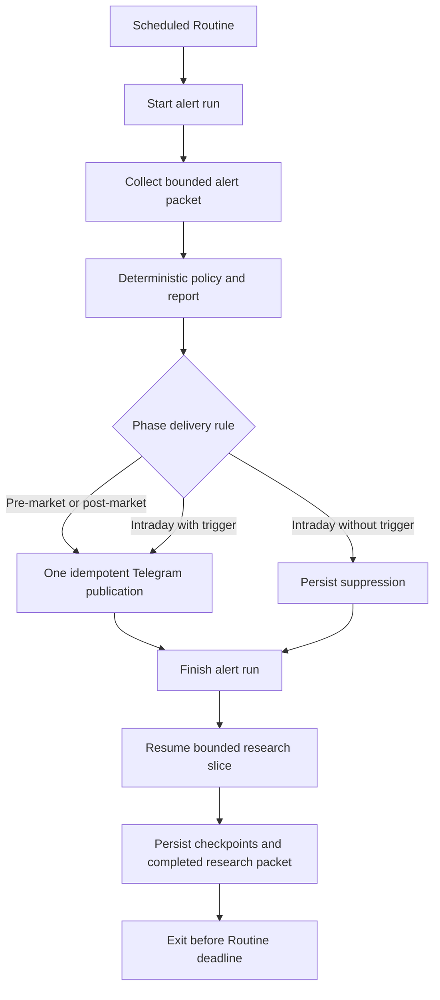

# Reliable Telegram Alert and Resumable Research Design

**Date:** 2026-09-15  
**Status:** In-chat design approved; written specification awaiting review  
**Product boundary:** Owner-only, suggestion-only, zero incremental cost

## Problem

The original scheduled agent reached Telegram reliably because each run performed a compact
portfolio/watchlist analysis and then sent the brief. The market-wide V1 placed a much larger
collection graph before every publication. The September 15 pre-market run proves that this graph
does not reliably fit in the cloud Routine execution window: it persisted 24 planned discovery
tasks, completed nine GDELT tasks, failed the SEC reference task, and stopped with fourteen tasks
still planned. It created no completed collection, evidence packet, report, publication, or Telegram
attempt.

Checkpoint recovery protects data integrity, but it does not make the complete graph fast enough to
serve as the blocking path for a timely alert. Waiting longer and invoking the same collector again
still consumes the same finite Routine window. The delivery path and the research path therefore
need separate completion contracts.

## Goals

1. Send one useful pre-market brief and one useful post-market brief on every open US trading day.
2. Keep intraday Telegram silent unless a configured portfolio, plan, or new-opportunity trigger
   fires.
3. Complete the timely alert path within a four-minute application budget under normal source
   latency.
4. Preserve market-wide discovery across the existing free sources without letting slow optional
   research block Telegram.
5. Retain exact-run idempotency, source receipts, deterministic policy, owner-only access, and the
   prohibition on trade execution.
6. Degrade safely when current data is incomplete: publish a factual status brief with no new action
   recommendation and a concise coverage note.

## Non-goals

- Brokerage connection or order execution.
- Paid, premium, trial, or metered market-data and model APIs.
- A promise of complete market coverage.
- Telegram delivery from the research lane.
- Duplicate publication to compensate for a failed or uncertain delivery.
- Expansion of the owner-only web application.

## Architecture

Each existing scheduled Routine runs two independent lanes in order. The alert lane has priority
and owns the phase's Telegram outcome. The research lane runs only after the alert lane has reached a
durable delivered, suppressed, failed, or uncertain terminal publication state.

The lanes use distinct run identities and distinct persistence records. An alert run can read only a
terminal research packet whose identity, hash, creation time, and coverage metadata were previously
validated by the gateway. A research run cannot publish, create an alert delivery, or alter an alert
run.

## Alert lane

### Inputs

The gateway returns a protected alert context containing:

- current holdings, cost basis, stops, owner overrides, and recurring plans;
- open suggestions and their validity windows;
- the most recent accepted phase report and outstanding alert lifecycle state;
- current session/calendar status;
- the latest terminal market-wide research packet within its permitted freshness window;
- the bounded owner-priority themes already stored in theme memory.

The command then collects a small live packet. Its reviewed ceiling is eight outbound source
requests and three minutes of collection time. The packet covers:

- batched current quotes required for held positions, active plans, and still-valid open
  suggestions;
- broad market context for SPY, QQQ, and IWM;
- one general current-market event query;
- up to two owner-priority theme queries selected deterministically from due theme memory.

Provider calls and protected checkpoint writes may finish below those ceilings. They may not expand
to consume unused research-lane capacity. The alert lane does not refresh the SEC company universe;
it uses the current protected security reference and excludes any new ticker whose identity cannot
be validated from that reference.

The previous research packet is eligible only when it belongs to the most recent prior open trading
session within five calendar days. The packet age is always visible to policy. Older or nonterminal
research is omitted rather than silently carried forward.

### Fast-lane packet contract

The packet records:

- `lane: "alert"`;
- the exact alert run ID and phase;
- source receipt IDs and cache keys;
- live quote timestamps and session labels;
- the prior research packet ID and hash, when one was used;
- accepted items, dropped items, unavailable sources, and coverage limits;
- `actionable_data_complete`, calculated by deterministic gateway policy.

`actionable_data_complete` is true only when every price used for a new action is fresh, symbol-bound,
USD-denominated, and validated under the existing quote policy. Missing general news or an optional
theme source does not make portfolio status unavailable. It does prevent a new research-derived
action when the required evidence is missing.

### Deadline behavior

The alert collector owns an internal monotonic deadline and stops beginning new optional requests
when fewer than 30 seconds remain. It completes and persists a partial packet from already-terminal
tasks. An unavailable or timed-out source becomes a bounded coverage gap.

If the packet cannot support new action, the routine still builds a status report from protected
portfolio state and any valid live market data. The report states `No new action — data check
incomplete` and names only the unavailable coverage categories. It must not show invented prices,
levels, returns, or conclusions.

The caller never waits for or restarts the market-wide collector before finishing the alert lane.

## Delivery behavior

Pre-market and post-market are expected-publication phases on open trading days. Each produces a
clear Telegram brief even when policy approves no trade suggestion. Intraday remains trigger-only;
the no-trigger result is a durable suppression and sends nothing. Holidays follow the existing
holiday behavior.

The delivery idempotency key binds owner, market date, phase, alert run ID, renderer version, and
exact body hash. The gateway permits at most one Telegram attempt for that identity. Existing
`pending`, `delivered`, `failed`, and `unknown` transport states remain authoritative:

- `delivered` stores the original Telegram message ID;
- `failed` is terminal for the run;
- `unknown` may already have been accepted and cannot be resent;
- an identical retry may only read or reconcile the original transport receipt.

The daily brief keeps the concise renderer structure already approved by the owner: portfolio,
market, open zones or risks, the next-session item, and a short coverage note when needed. Audit IDs,
raw checker prose, and internal task counts remain on the owner-only web surface.

## Research lane

The research lane preserves the existing market-wide capability planner, source cursors, SEC
reference, event-first discovery, ticker-free entity resolution, primary exposure enrichment, and
theme memory. It runs with a bounded wall-clock slice after the alert terminal state.

Each invocation:

1. resumes the oldest eligible nonterminal research run or starts the phase's scheduled research
   run when no eligible run exists;
2. reads its persisted tasks and terminal checkpoints;
3. executes tasks in deterministic priority order until its four-minute research budget is reached;
4. stops before the deadline, leaving unstarted tasks in `planned` state;
5. persists a completed research packet only after the plan's required completion rules pass.

Planned tasks are safe work awaiting another slice. They are not an alert failure. A task left in
`attempting` state follows the existing uncertain-outcome barrier and is never blindly repeated.
Completed research packets become eligible input for later alert runs. Research freshness is
reported explicitly; older research may support context, but it cannot supply a current executable
price or override current invalidation evidence.

No research-run status can create, suppress, retry, or reconcile Telegram delivery.

## Scheduling

The three existing weekday Routines remain at 06:30, 12:00, and 15:10 America/Chicago. No additional
paid service or scheduled job is introduced.

The phase sequence is:

1. run the alert lane and reach its terminal publication/suppression state;
2. run one research slice with the remaining bounded budget;
3. stop cleanly.

If the environment ends during research, the next normal scheduled phase resumes from protected
checkpoints. If the environment ends before an alert terminal state, the next invocation reconciles
that exact alert run and does not start a duplicate publication.

## Persistence and gateway authority

An additive migration records lane identity and the minimum fields needed to distinguish alert runs,
research runs, packets, and terminal outcomes. Existing immutable migrations remain unchanged.

Gateway request schemas reject:

- research packets submitted as alert packets;
- nonterminal or hash-mismatched research packet references;
- publication attempts attached to research runs;
- a second delivery identity for the same scheduled alert phase;
- new action recommendations when `actionable_data_complete` is false;
- alert completion before the packet, policy, report, and delivery/suppression receipts agree.

All externally sourced prose remains untrusted data. Renderer and policy authority stay server-side.

## Failure handling

| Failure | Alert-lane result | Research-lane result |
|---|---|---|
| Optional source unavailable | Publish with coverage note; block dependent new actions | Persist bounded task failure and continue |
| Required action quote stale/missing | Publish status-only brief; no dependent new action | Continue unrelated research |
| Research packet stale/missing | Publish from live alert inputs with disclosed limitation | Resume or create research work |
| Routine time nearly exhausted | Finish alert terminal state; skip research slice | Persist current checkpoint and stop |
| Telegram definitively failed | Persist `delivery_failed`; do not resend | No effect |
| Telegram outcome uncertain | Persist `delivery_unknown`; reconcile original receipt only | No effect |
| Holiday | Preserve reviewed holiday notification/suppression behavior | Do not start unnecessary market research |

## Verification

Implementation is accepted only when automated tests prove:

1. twenty-four slow or unavailable research tasks cannot delay alert publication;
2. the alert collector stops within its deadline and persists a valid partial packet;
3. missing actionable quotes produce a status-only brief and zero new actionable suggestions;
4. pre-market and post-market each produce one expected-publication outcome on an open day;
5. intraday with no trigger persists suppression and sends nothing;
6. an interrupted research slice resumes planned work without repeating completed or uncertain
   provider attempts;
7. research runs cannot invoke Telegram or mutate alert publication state;
8. retry/recovery cannot create a second Telegram attempt;
9. rendered messages retain the concise approved layout and source-link safety;
10. full local tests, exact-head CI, exact-main CI, protected backend release, and read-only
    production verification pass.

Production closeout requires one normal scheduled pre-market or post-market alert after deployment
with a terminal report/publication chain and either its original Telegram message ID or an explicit
transport terminal state. It also requires a later read-only receipt showing that research work
continued without blocking that alert. No duplicate live run is used to manufacture this proof.

## Rollout and rollback

Release proceeds through the existing protected PR, exact-main CI, owner authorization, backend
deployment, and readback path. The owner-only Site is republished only if its built bytes change.

The existing full-collector-before-publication behavior remains available only as a rollback target
for source and schema compatibility; scheduled prompts switch atomically to the alert-first
sequence. Rollback restores the prior Edge functions and prompt version while retaining additive
lane rows and all audit receipts. Historical research and delivery records are never deleted or
rewritten.
